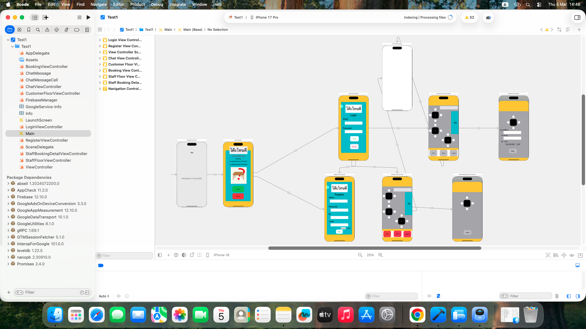

#  Toh Nai Dee – Instant Table Booking

###  **Language:** Swift
###  **Online Database:** Firebase

---
> An iOS table reservation app built with **Swift** and **Firebase**, featuring separate logins for customers and staff. Users can customize table bookings (seating location, time, guest count) and chat directly with support in real time..

---

## 🖼️ Project Overview

 **[Click here to view the complete mobile application user flow ](https://drive.google.com/drive/folders/1IEokzFlAO95_gXms2IVkL3ffxDVKakUo?usp=drive_link)**

## 📁 Project Structure

> *Overview of the core Xcode project hierarchy and directory layout.*

---

## 🛠️ Getting Started (Setup Guide)

### 1. Move Project Folder
Copy or move the **Smart Virtual Cafe Table Reservation System** project folder to your preferred directory on your Mac (e.g., `Desktop` or `Documents`).

### 2. Open Project with Xcode
Inside the project folder, locate the file with the extension **`.xcodeproj`** or **`.xcworkspace`**:
* Double-click the file to open the project in Xcode.
* *(Recommended: If both files are present, open **`.xcworkspace`**).*

### 3. Verify Dependencies & Firebase Setup
If the project relies on external packages or Firebase SDK:
* **Swift Package Manager (SPM):** Xcode will resolve dependencies automatically upon opening. Observe the top status bar and wait until it displays `Ready`.
* **CocoaPods:** If CocoaPods is used, open Terminal, navigate (`cd`) to the project directory, and run `pod install` prior to opening `.xcworkspace`.
* **GoogleService-Info.plist:** Ensure the Firebase configuration file (`GoogleService-Info.plist`) is included in the project root folder.

### 4. Select a Target Simulator
From the Xcode top toolbar, select your desired test device/simulator (e.g., **iPhone 15**, **iPad**, or **My Mac**).

### 5. Run the Project
* Click the **Play (▶️)** button at the top-left corner of the Xcode window.
* Or press the keyboard shortcut **`Command + R` (`⌘ + R`)**.

### 6. Launch & Test
Xcode will build and compile the application. Once complete, the Simulator will launch automatically, ready for testing.

---

## 🛠️ Tech Stack & Services
- **Language:** Swift
- **IDE:** Xcode
- **Backend & Database:** Firebase (Cloud Firestore / Realtime Database)
- **Authentication:** Firebase Auth

---

